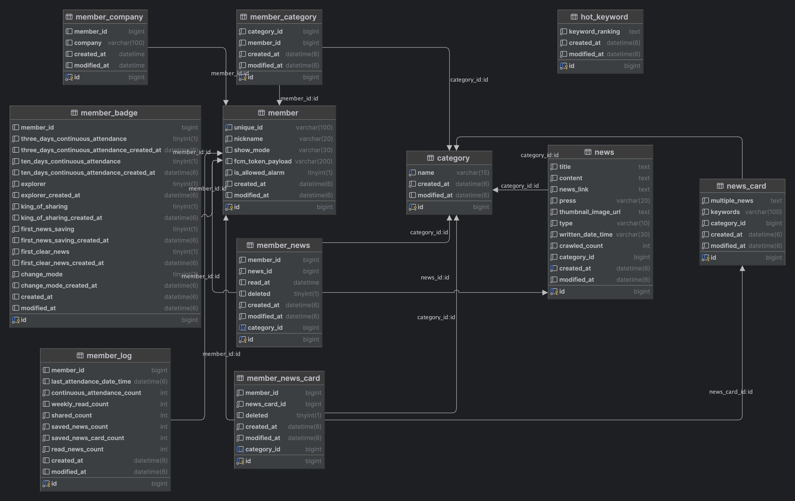
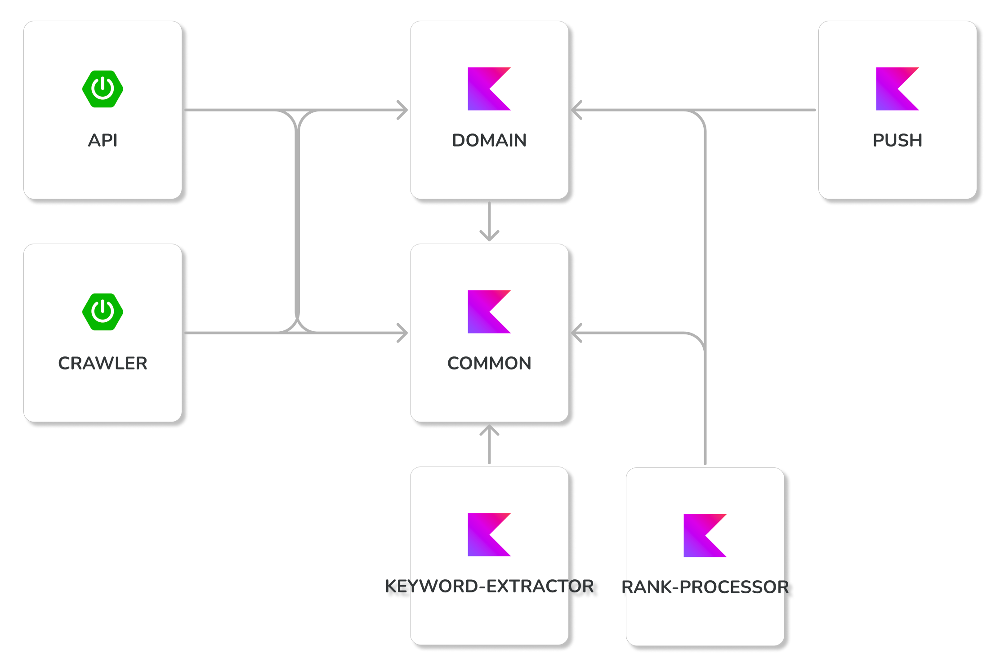
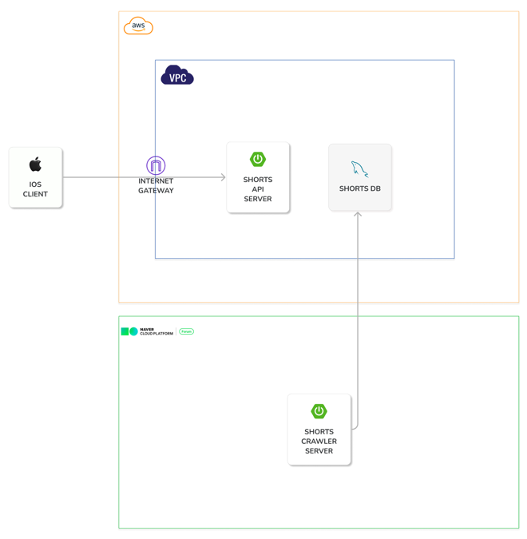

## ERD

## Module Architecture

## Infrastructure

---

## 역할

<table>
    <tr align="center">
        <td><B>최정균(Server)<B></td>
        <td><B>김도현(Server)<B></td>
        <td><B>박세원(Server)<B></td>
    </tr>
    <tr align="center">
        <td>
            
             
            <a href="https://github.com/wjdrbs96"><I>gyunny</I></a>
              인프라 셋팅, REST DOCS 셋팅, 사용자 관심 카테고리 기능 개발
        </td>
        <td>
          
             
            <a href="https://github.com/k-diger"><I>K-Diger</I></a>
              크롤러, 키워드 추출, 뉴스/뉴스카드 조회, 사용자 업적/뱃지 기능 개발
        </td>
        <td>
            
             
            <a href="https://github.com/sw-develop"><I>sw-develop</I></a>
              핫 키워드 랭킹 기능 개발
        </td>
    </tr>
</table>
